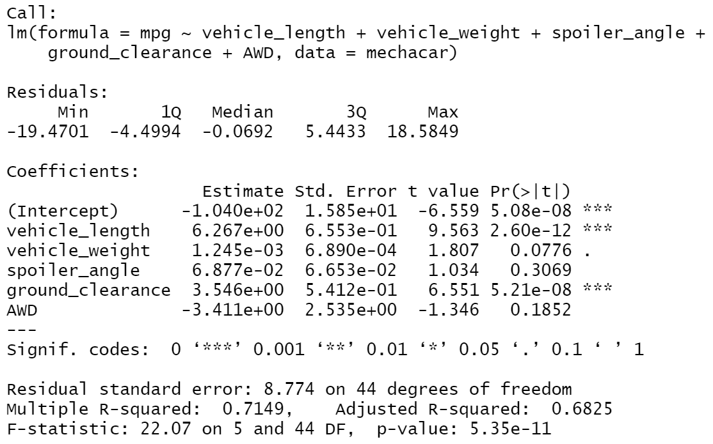
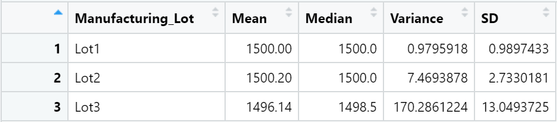
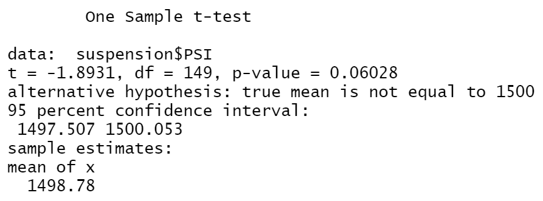
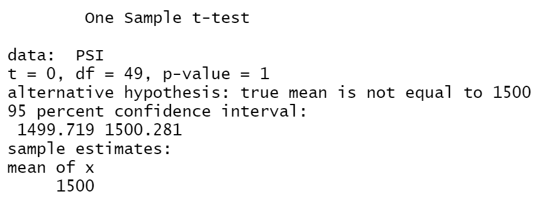
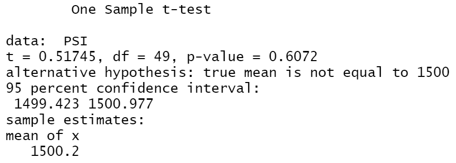
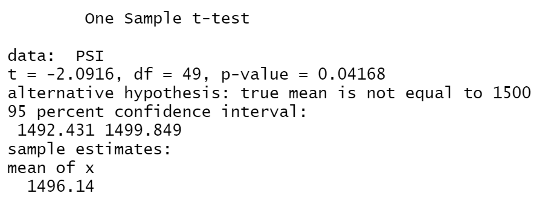

# MechaCar Statistical Analysis

## Linear Regression to Predict MPG

- The variables that provide a non-random amount of variance to the mpg values are vehicle length and ground clearance. These variables provide a significant contribution to the linear model because their individual p-values are less than 0.05.
- The slope of the linear model is not zero. The p-value of the linear regression is 5.35e-11 which is less than the significance level of 0.05 and means there is sufficient evidence to reject the null hypothesis that the slope is zero.
- The linear model predicts mpg of MechaCar prototypes effectively, but there is room for improvement. The r-squared value is 0.7149 which means that about 71% of the variability of mpg is explained using this model. There might be other variables not included in the model that could help explain the variability of mpg.

## Summary Statistics on Suspension Coils

The total summary dataframe above shows that the overall variance of suspension coils is 62.29. Since this does not exceed 100 PSI, the current manufacturing data for all lots in total meets the design specification. 

Based on the lot summary dataframe above, there is a wide range of variances for the individual manufacturing lots. Lot1 and Lot2 meet the design specification of variance less than 100 PSI, since their variances are 0.98 and 7.47 respectively. Lot3, however, does not meet the design specification since its variance is 170.29 which exceeds 100 PSI.

## T-Tests on Suspension Coils

### All Manufacturing Lots

The t-test calculates a p-value of 0.06028 which is above the significance level of 0.05. Therefore, there is not sufficient evidence to reject the null hypothesis and the PSI across all manufacturing lots is not statistically different from the population mean of 1,500 PSI.

### Manufacturing Lot1

The t-test calculates a p-value of 1 which is above the significance level of 0.05. Therefore, there is not sufficient evidence to reject the null hypothesis and the PSI for manufacturing Lot1 is not statistically different from the population mean of 1,500 PSI.

### Manufacturing Lot2

The t-test calculates a p-value of 0.6072 which is above the significance level of 0.05. Therefore, there is not sufficient evidence to reject the null hypothesis and the PSI for manufacturing Lot2 is not statistically different from the population mean of 1,500 PSI.

### Manufacturing Lot3

The t-test calculates a p-value of 0.04168 which is lower than the significance level of 0.05. Therefore, there is sufficient evidence to reject the null hypothesis and the PSI for manufacturing Lot3 is statistically different from the population mean of 1,500 PSI.

## Study Design: MechaCar vs Competition

In order to compare performance of the MechaCar vehicles against performance of vehicles from other manufacturers, the statistical study will focus on testing city fuel efficiency based on manufacturer. The null hypothesis is that the means of all groups are equal, while the alternative hypothesis is that at least one of the means is different from all other groups. To test the hypothesis an analysis of variance (ANOVA) test will be used because we need to compare means across more than two samples. The dependent variable, mpg, is numerical and continuous, while the independent variable, manufacturer, is categorical with multiple groups. To run the statistical test, we need city fuel efficiency (mpg) data from MechaCar vehicles and vehicles from other manufacturers that are considered its competition. The data will need to be contained in a single data frame to use the aov() function in R. If the test calculates a significant difference in city fuel efficiency between at least one manufacturer and the others, further testing will need to be done to determine which one.
